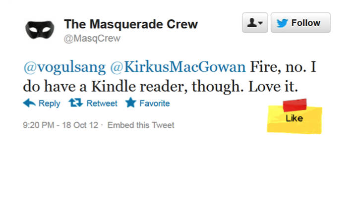

### Improve your **product** and find what features are desired

### Mission
Cruxly provides analytics technology for intent and event detection, that is highly valuable for engagements broadly in customer and partner engagements in marketing, product management, and support

### Patented technology
The Cruxly team collectively has more than 50 years of NLP experience, and is led by Aloke Guha who holds 6 patents (of 25 issued) related to machine learning and data mining.   
